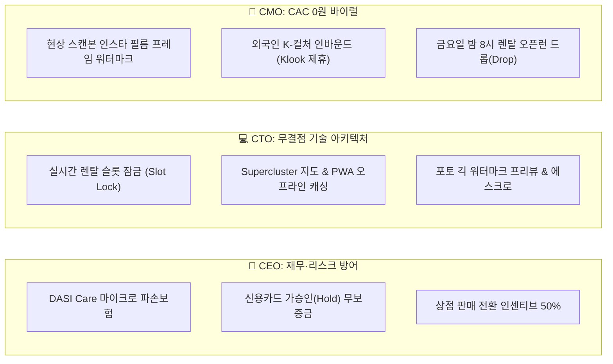

# 🧭 「다시 (DASI)」 프로젝트 북극성 (North Star Charter)

> **"그때 그 취미, 다시"**  
> 본 문서는 「다시 (DASI)」 프로젝트의 최초 발의부터 C-Level 심층 토론, 그리고 구현 직전까지 오간 모든 전략적 의사결정과 제품 철학을 누락 없이 기록한 **단일 진실 공급원(Single Source of Truth)**이자 **불변의 개발 나침반**입니다.

---

## 📅 타임라인 및 버전 히스토리
- **문서 버전**: v1.0.0 (Master Blueprint)
- **최종 확정일**: 2026.09.21
- **적용 대상**: DASI 웹/앱 전 기능 구현, 데이터 파이프라인, 비즈니스 룰, UX/UI 디자인 시스템

---

## 1. 프로젝트 발단 및 초기 가설 검토

### 1-1. 초기 기획안 요약 (Draft v0.1)
- **비전**: 필름카메라·헌책·LP 등 "그때 그 취미"를 다시 찾는 30~50대 및 2030을 위한 감정 기반 큐레이션 마켓 + 오프라인 상점 온라인화.
- **초기 솔루션**:
  - 사진 3장 기반 AI 감정 (모델·연식·상태 등급·시세 추정 → 감정서 발급).
  - 오프라인 상점 입점 대행 (팀이 촬영·등록·배송 대행, 상인은 검수만).
  - 에스크로 결제 기반 거래 마켓.

### 1-2. 3대 전문 관점 초기 비평 (Architect / Designer / QA)
1. **구글 수석 아키텍트 관점 (Fact-Grounded Integrity)**:
   - 비전 AI로 외관 모델 판별은 가능하나, **셔터막 끊김, 렌즈 곰팡이/발삼 분리, 노출계 배터리 누액 등 내부 기능 결함은 사진 3장으로 판별 불가**.
   - 대안: **Hybrid 검수 체계** (1차 AI 외관 판정 + 2차 상인/전문가 기능 체크리스트 + 실거래가 DB 기반 시세 밴드 분리).
2. **애플 수석 디자이너 관점 (Radical Simplicity & 4 States)**:
   - 과도한 레트로 장식을 배제하고 모던 미니멀리즘(화이트/어스톤)으로 신뢰 구축.
   - 4대 화면 상태(Loading, Empty, Error, Active) 엄격 준수 및 디지털 보증서(Certificate) 카드 UI 도입.
3. **글로벌 품질 책임자 관점 (Unit Economics & Zero-Defect)**:
   - 3인 팀이 수천 개 품목의 '촬영·등록·배송'을 대행하는 것은 물리적 오퍼레이션 과부하를 초래함.
   - 빈티지 기기의 상태 분쟁을 막기 위한 명문화된 상태 등급제(Mint, Excellent, Good, As-Is)와 보증 정책 필요.

---

## 2. 제품 철학: 웹 사용자가 얻는 4대 핵심 가치

당근마켓, 번개장터가 절대 줄 수 없는 DASI만의 대체 불가능한 4대 가치 기둥:

| 핵심 가치 | 상세 설명 및 제공 경험 |
| :--- | :--- |
| **① "첫 롤을 날리지 않는 안심" (Trust & Zero-Defect)** | • 당근의 '작동 여부 모름(노리턴)' 공포 제거. • 오버홀(분해소제·점검) 완료 기기 인증 및 7일 무상 환불 + 30일 상점 연계 무상 AS. • 단순 외관 사진 외에 **'실제 촬영·현상 샘플'** 및 셔터음/조작 영상 제공. |
| **② "깜깜이 가격을 끝내는 투명한 데이터" (Fair Pricing)** | • 오프라인/카페의 부르는 게 값인 시장에 **최근 1년 실거래 데이터 기반의 적정 시세 밴드** 제공. • "내가 바가지 쓰지 않고 적정가에 샀다"는 데이터 확신 부여. |
| **③ "골목길 장인의 온기와 헤리티지 스토리" (Human-Touch & Storytelling)** | • 차가운 공산품 거래가 아닌 '문화와 역사'를 소비하는 에디토리얼 매거진 경험. • 세운상가 40년 장인의 정밀 점검 서명 카드 동봉. |
| **④ "나만의 빈티지 아카이빙 캐비닛" (Digital Heritage Passport)** | • 구매/소장 기기의 고유 시리얼 넘버 및 수리 이력 아카이빙. • 추후 기변 시 DASI 이력을 기반으로 원클릭 재판매(Resell) 가능 (감가 방어). |

---

## 3. 핵심 비즈니스 모델 피봇 (Pivot & Expansion)

대화 과정을 통해 비약적으로 진화한 5가지 핵심 전환점:

### 🌟 Pivot 1. 렌탈 메인화 (Rent-to-Own) & 방문 픽업
- **Rent-to-Own (대여 후 소장 전환)**:
  - 35~50만 원 구매 허들을 **주말 3~5만 원 대여(체험)**로 파괴.
  - 써보고 사진에 반하면 대여료 전액을 차감하고 차액만 결제하여 즉시 인수.
- **방문 픽업 (Shop as a Station)**:
  - 택배 배송 시 충격으로 인한 렌즈/셔터막 파손 리스크 100% 해소.
  - 매장 방문 시 40년 경력 사장님의 **'1:1 10분 온보딩 튜토리얼 (필름 장착 및 기기 조작 강습)'** 제공.

### 🌟 Pivot 2. 사진작가 출사 & 장인 클래스 (Experience Economy)
- **주말 출사 클럽 (Photo Walk)**: 인스타 인기 감성 사진작가와 함께하는 을지로/성수 골목길 출사 티켓팅.
- **장인 워크숍**: 흑백 필름 자가 현상, 암실 인화, 렌즈 클리닝 원데이 클래스.

### 🌟 Pivot 3. 수리/오버홀 명장 발굴 & 제휴 쿠폰 샵 등록 BM
- **닥터 DASI (Repair Hub)**: 충무로/세운상가/남대문 40년 수리 명장 네트워크 구축.
- **증상 기반 온라인 간편 견적**: 셔터막/곰팡이/노출계 고장 증상 선택 시 사전 예상 견적 회신.
- **B2B 수익 모델**: 제휴 샵 등록비(SaaS), 수리 중개 수수료, 선결제 쿠폰 패키지(바우처) 판매.

### 🌟 Pivot 4. 아날로그 스팟 맵 & 소액 홍보비 (Micro-Ads)
- **아날로그 스팟 지도**: 전국 현상소, 필름샵, 24시 무인 자판기, 수리점 위치 및 실시간 메타데이터 제공.
- **킬러 데이터**: 당일 스캔 마감 카운트다운, 스캐너 기종(노리츠 vs 후지)별 색감 비교 갤러리, 실시간 필름 재고 핑.
- **소액 홍보비(Micro-Ads)**: 월 14,900원~29,900원의 DASI 인증 파트너 골드 핀, 지도 상단 노출, 쿠폰 발행 권한.

### 🌟 Pivot 5. 장비 라인업 확장 & C2C '로컬 포토 긱'
- **장비 확장**: 클래식 필름카메라뿐만 아니라 **'감성 하이엔드 디카(Fujifilm X100VI, Ricoh GR3x, Leica Q)'** 및 **'Y2K 빈티지 CCD 디카(쿨픽스, 익서스)'**까지 렌탈 스펙트럼 확장.
- **로컬 포토 긱 (Local Photo Gig)**:
  - 성수/북촌 외국인 관광객 1시간 감성 스냅 (3~5만 원).
  - 친구/하객 시선의 가성비 서브 웨딩 비하인드 필름 스냅 (7~10만 원).
  - 유저가 카메라를 빌려 직접 스냅 알바로 돈을 벌어 렌탈비를 회수하는 선순환 루프.
- **2-Track 브랜드 분리**: 캐주얼한 메인 플랫폼(DASI) vs 하이엔드 전문 작가 단독 스튜디오관(DASI Pro) 분리.

---

## 4. C-Suite (CEO / CTO / CMO) 전략 토론 결과

---

## 5. 단계별 실행 로드맵 (Phase 1 vs Phase 2)

### 🚀 Phase 1: 코어 웹 MVP (현재 구현 단계)
1. **카메라 렌탈 & Rent-to-Own 엔진**:
   - 필카 + 후지/리코/라이카 감성 디카 + Y2K 디카 라인업.
   - 날짜 선택, 방문 픽업 거점 선택, 렌탈비 공제 소장 전환 실시간 계산.
2. **아날로그 스팟 맵 (Analog Spot Map)**:
   - 전국 현상소, 필름샵, 24시 자판기, 수리점 인터랙티브 지도.
   - 마이크로애즈 소액 홍보 파트너 골드 뱃지 & 실시간 재고 핑.
   - 당일 스캔 마감 카운트다운 & 노리츠/후지 스캐너 색감 비교 갤러리.
3. **로컬 포토 긱 (Local Photo Gig)**:
   - 지역 기반(성수/북촌/을지로) 생활 스냅 구인/구직 마켓.
   - 외국인 투어 스냅, 서브 웨딩, 감성 일상 스냅, 안심 에스크로 안내.
4. **닥터 DASI 명장 클리닉 & 쿠폰함**:
   - 40년 수리 명장 프로필 & 고장 증상별 간편 견적 신청 모달.
   - 웰컴 케어 지갑 (제휴 현상소 1롤 무료 스캔, 수리 점검 할인권).
5. **DASI Pro 스냅관 연계 게이트웨이**:
   - 하이엔드 전문 사진작가 스튜디오 단독 브랜드관 연계 배너.

### 🗺️ Phase 2: 정보 & 탐색 허브 확장 (차기 구현 단계)
1. **서울 시내 실시간 문화 행사 & 축제 캘린더**:
   - 궁중문화축전(달빛기행), 서울세계불꽃축제, 정동 야행, 서울 빛초롱축제 등.
   - 축제별 필름/디카 추천 설정값, 추천 화각, 준비물 가이드.
2. **지역별 출사 Hot Spot 가이드**:
   - 을지로 세운상가 공중보행로, 성수동 붉은벽돌 골목, 용산 백빈건널목, 혜화 낙산공원.
   - 장소별 매직아워(골든아워) 타임테이블, 추천 화각(단렌즈 vs 광각 vs 망원), 촬영 꿀팁.

---

## 6. 개발 헌장 및 원칙 (Engineering & Quality Charter)
- **구글 관점**: 데이터는 항상 실측치(Actual)와 추정치(Estimated)를 분리하고 단일 진실 공급원을 유지한다.
- **애플 관점**: 모던 미니멀리즘과 4pt/8pt 리듬을 지키며, 4대 화면 상태(Loading, Empty, Error, Active)를 완결한다.
- **품질 관점**: `npx tsc --noEmit` 타입 에러 0건, `npm run build` 성공을 통과한 무결점 코드만을 배포한다.
- **영구 보존**: 모든 변경 사항은 의미 있는 커밋 메시지와 함께 즉시 Git으로 관리한다.
